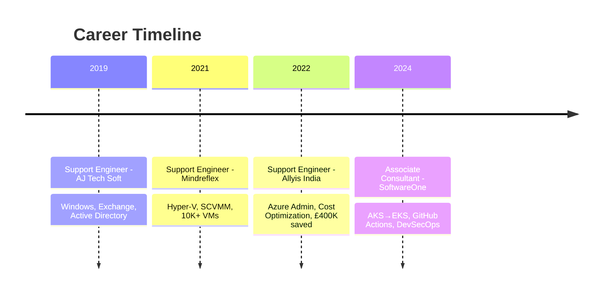

<div align="center">

<!-- Animated Header with Cyberpunk/Neon Vibe -->


<!-- Animated Typing -->
<a href="https://git.io/typing-svg">
  
</a>

<br/>

<!-- Animated Badges Row -->
<a href="https://github.com/amidevop"></a>
<a href="https://github.com/amidevop"></a>


<br/><br/>

<!-- Animated Wave Divider -->


</div>

<!-- ABOUT ME - Glassmorphism Style -->
##  About Me

```js
const amitKumar = {
    role: "Associate Consultant @ SoftwareOne",
    location: "Bengaluru, India 🇮🇳",
    experience: "6+ years",
    
    currentFocus: [
        "☸️ AKS → EKS Migration (200+ apps)",
        "🔐 DevSecOps with CodeQL & SonarCloud",
        "🏗️ Infrastructure as Code with Terraform",
        "🚀 CI/CD with GitHub Actions & Azure DevOps"
    ],
    
    superpower: "Reduced cloud spend from £1.4M → £1M/month 💰",
    
    certifications: [
        "AZ-104", "AZ-305", "AZ-700", "AZ-500",
        "MS-100", "MS-203", "Terraform", "Kubernetes"
    ],
    
    motto: "Automate Everything. Deploy Anywhere. Scale Infinitely. 🔥"
};
```

<div align="center">

</div>

##  Tech Arsenal

<div align="center">

<!-- Animated Skill Icons -->
<p>
  
</p>

<br/>

<!-- Detailed Tech Cards -->
<table>
<tr>
<td align="center" width="25%">

**☁️ CLOUD**
<br/><br/>

<br/>


</td>
<td align="center" width="25%">

**☸️ CONTAINERS**
<br/><br/>

<br/>


</td>
<td align="center" width="25%">

**🚀 CI/CD**
<br/><br/>

<br/>


</td>
<td align="center" width="25%">

**🏗️ IaC**
<br/><br/>

<br/>


</td>
</tr>
</table>

<br/>

<!-- Additional Skills Bar -->


</div>

<div align="center">

</div>

##  Featured Projects

<div align="center">

<a href="#">
  
</a>
<a href="#">
  
</a>

</div>

<br/>

<div align="center">

<!-- Project Highlights with Metrics -->
<table>
<tr>
<td align="center" width="50%">

### ☸️ AKS → EKS Migration

<br/><br/>
Migrated **200+ microservices** from Azure AKS to AWS EKS with zero downtime using Helm charts, GitHub Actions, ECR, EFS & AWS Secrets Manager
<br/><br/>
`Kubernetes` `Helm` `GitHub Actions` `ECR` `EFS`

</td>
<td align="center" width="50%">

### 💰 Cloud Cost Optimization

<br/><br/>
Slashed Azure cloud spend from **£1.4M → £1M/month** using reserved instances, spot pricing, rightsizing & storage tiering
<br/><br/>
`Azure Advisor` `FinOps` `Reserved Instances` `Rightsizing`

</td>
</tr>
<tr>
<td align="center" width="50%">

### 🔄 Jenkins → GitHub Actions

<br/><br/>
Migrated all CI/CD pipelines from Jenkins to GitHub Actions, improving maintainability, speed & governance
<br/><br/>
`GitHub Actions` `DevOps` `Automation`

</td>
<td align="center" width="50%">

### 🔐 DevSecOps Integration

<br/><br/>
Enabled CodeQL & SonarCloud scanning for **Node.js, Java, .NET & Go** applications across all repositories
<br/><br/>
`CodeQL` `SonarCloud` `SAST` `Security`

</td>
</tr>
</table>

</div>

<div align="center">

</div>

##  GitHub Stats

<div align="center">

<!-- Animated Stats Cards with Dark Theme -->


<br/><br/>

<!-- Streak Stats -->


<br/><br/>

<!-- Activity Graph -->


</div>

<div align="center">

</div>

## 🏆 Certifications

<div align="center">

<!-- Animated Certification Badges -->


<br/>


</div>

<div align="center">

</div>

## 🏢 Experience Journey

<div align="center">



</div>

<div align="center">

</div>

## 🐍 Contribution Snake

<div align="center">

<picture>
  <source media="(prefers-color-scheme: dark)" srcset="https://raw.githubusercontent.com/amidevop/amidevop/output/github-snake-dark.svg" />
  <source media="(prefers-color-scheme: light)" srcset="https://raw.githubusercontent.com/amidevop/amidevop/output/github-contribution-grid-snake.svg" />
  
</picture>

</div>

<!-- Snake Workflow Setup Instructions (hidden) -->
<!--
To enable the snake animation, create .github/workflows/snake.yml:

name: Generate Snake
on:
  schedule:
    - cron: "0 0 * * *"
  workflow_dispatch:
jobs:
  generate:
    runs-on: ubuntu-latest
    timeout-minutes: 10
    steps:
      - name: Generate Snake
        uses: Platane/snk/svg-only@v3
        with:
          github_user_name: ${{ github.repository_owner }}
          outputs: |
            dist/github-contribution-grid-snake.svg
            dist/github-contribution-grid-snake-dark.svg?palette=github-dark
            dist/github-snake-dark.svg?palette=github-dark
      - name: Push to output branch
        uses: crazy-max/ghaction-github-pages@v4
        with:
          target_branch: output
          build_dir: dist
        env:
          GITHUB_TOKEN: ${{ secrets.GITHUB_TOKEN }}
-->

<div align="center">

</div>

##  Connect With Me

<div align="center">

<a href="https://www.linkedin.com/in/amitkumar-devops">
  
</a>
&nbsp;
<a href="https://github.com/amidevop">
  
</a>
&nbsp;
<a href="mailto:amimapasu@gmail.com">
  
</a>

<br/><br/>

<!-- Quote -->


<br/><br/>

<!-- Fun Counter -->


</div>

<br/>

<div align="center">

### 💬 _"Infrastructure is code. Pipelines are products. Cloud is home."_

<br/>

<!-- Animated Footer -->


</div>
