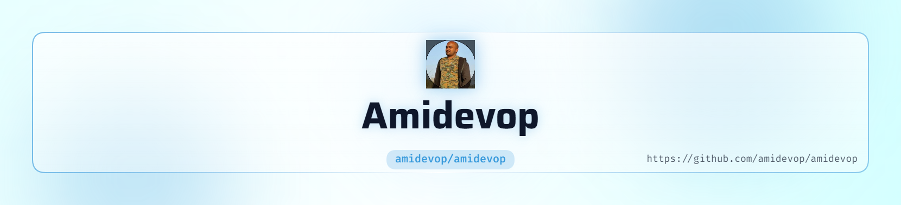

<picture>
   <source media="(prefers-color-scheme: dark)" srcset="art/header-dark.png">
   
</picture>

# 🌸 GitHub Profile README

<!-- Source: Resume provided by Amit Kumar :contentReference[oaicite:0]{index=0} -->

<picture>
  <source media="(prefers-color-scheme: dark)" srcset="https://capsule-render.vercel.app/api?type=waving&color=0:EF93C4,100:FF69B4&height=220&section=header&text=Amit%20Kumar&fontSize=55&fontColor=ffffff&animation=fadeIn&fontAlignY=35">
  <source media="(prefers-color-scheme: light)" srcset="https://capsule-render.vercel.app/api?type=waving&color=0:F8BBD0,100:EF93C4&height=220&section=header&text=Amit%20Kumar&fontSize=55&fontColor=ffffff&animation=fadeIn&fontAlignY=35">
  
</picture>

# Hey there, I'm Amit Kumar 👋

  
  
  

---

## 🌸 About Me

<table>
<tr>
<td width="65%" valign="top">

### 👨‍💻 DevOps & Cloud Engineer

I'm a **DevOps and Cloud Engineer with 6+ years of experience** working across cloud platforms, Kubernetes, CI/CD automation, infrastructure operations, and enterprise environments. :contentReference[oaicite:1]{index=1}

- ☁️ Azure & AWS Cloud
- ☸️ Kubernetes, AKS & EKS
- 🚀 GitHub Actions & Azure DevOps
- 🏗️ Terraform & Infrastructure as Code
- 🔐 DevSecOps, CodeQL & Security Automation
- 🐳 Docker & Helm
- ⚙️ PowerShell, Bash & YAML Automation
- 🔄 AKS → EKS Migration
- 📦 ECR, ACR & Container Platforms
- 📊 Azure Monitor & Log Analytics
- 💰 Azure Cloud Cost Optimization
- 🛡️ Enterprise Cloud Security & Governance

Currently working as an **Associate Consultant at SoftwareOne**, with a strong focus on cloud modernization, Kubernetes migration, CI/CD automation and DevOps engineering. :contentReference[oaicite:2]{index=2}

</td>

<td width="35%" align="center">

  

</td>
</tr>
</table>

---

## ☁️ Cloud & DevOps Expertise

| Area | Technologies |
|---|---|
| ☁️ **Cloud** | Azure • AWS |
| ☸️ **Containers** | Kubernetes • AKS • EKS • Docker • Helm |
| 🚀 **CI/CD** | GitHub Actions • Azure DevOps • Jenkins • GitLab CI/CD |
| 🏗️ **IaC** | Terraform • ARM Templates • Ansible |
| 🔐 **DevSecOps** | CodeQL • SonarCloud • GitHub Enterprise Server |
| ⚙️ **Automation** | PowerShell • Bash • YAML • Microsoft Graph API |
| 📊 **Monitoring** | Azure Monitor • Log Analytics • Network Watcher • PRTG • SCOM • Zabbix |
| 🌐 **Networking** | VNet • VPN Gateway • ExpressRoute • Application Gateway • Azure Firewall • Load Balancer |
| 🔑 **Security** | RBAC • NSG • JIT • Service Principals • MFA • DLP • Conditional Access |
| 🖥️ **Systems** | Windows Server • Linux • Hyper-V • SCVMM • DNS • DHCP |

---

## 🛠️ Tech Stack

### ☁️ Cloud

### 🚀 DevOps & CI/CD

### ☸️ Containers & Kubernetes

### 🏗️ Infrastructure as Code

### 💻 Programming & Automation

---

## 🚀 Featured Projects

### ☸️ AKS → EKS Migration

Migrated **200+ applications from Azure Kubernetes Service to Amazon EKS**, using Helm, GitHub Actions, ECR, EFS, AWS Secrets Manager and Kubernetes deployment standardization. :contentReference[oaicite:3]{index=3}

### 🔄 Jenkins → GitHub Actions

Migrated CI/CD workflows from Jenkins to GitHub Actions to improve automation, maintainability and governance. :contentReference[oaicite:4]{index=4}

### 📦 Bitbucket → Azure Repos

Migrated repositories from Bitbucket to Azure Repos to consolidate source control and standardize repository management. :contentReference[oaicite:5]{index=5}

### 🔐 DevSecOps & CodeQL

Enabled CodeQL scanning for **Node.js, Java, .NET and Go applications** to strengthen repository security. :contentReference[oaicite:6]{index=6}

### 🏗️ Azure Infrastructure Automation

Designed and deployed Azure infrastructure using **Terraform and Azure Pipelines**, with focus on repeatability and automation. :contentReference[oaicite:7]{index=7}

---

## 📈 GitHub Analytics

---

## 🔥 GitHub Streak

---

## 📊 GitHub Activity

---

## 🐍 Contribution Snake

<!--
To enable the contribution snake, create:
.github/workflows/snake.yml

Example GitHub Action:

name: Generate Snake

on:
  schedule:
    - cron: "0 0 * * *"
  workflow_dispatch:

jobs:
  generate:
    runs-on: ubuntu-latest
    steps:
      - uses: Platane/snk@v3
        with:
          github_user_name: ${{ github.repository_owner }}
          outputs: |
            dist/github-contribution-grid-snake.svg
      - uses: crazy-max/ghaction-github-pages@v4
        with:
          build_dir: dist
        env:
          GH_PAT: ${{ secrets.GITHUB_TOKEN }}
-->

---

## 💼 Professional Experience

### Associate Consultant — SoftwareOne
**Sep 2024 – Present | Bengaluru**

☁️ Azure & AWS Cloud  
☸️ AKS → EKS migration  
🚀 GitHub Actions & Azure DevOps  
📦 ECR & Kubernetes  
🔐 CodeQL & DevSecOps  
🏗️ Terraform & Infrastructure Automation  

### Support Engineer — Allyis India Pvt. Ltd.
**Aug 2022 – Aug 2024 | Bengaluru**

☁️ Azure Administration  
💰 Cloud Cost Optimization  
🔐 Azure AD, RBAC, MFA & DLP  
🌐 Azure Networking  
📊 Azure Monitor & Log Analytics  
⚙️ PowerShell Automation  

### Support Engineer — Mindreflex Technology Pvt. Ltd.
**Dec 2021 – Jul 2022 | Bengaluru**

🖥️ Hyper-V & SCVMM  
⚙️ PowerShell Automation  
🌐 Active Directory, DNS & DHCP  
📊 Infrastructure Monitoring  

### Support Engineer — AJ Tech Soft Pvt. Ltd.
**Nov 2019 – Dec 2021 | Bengaluru**

🪟 Windows & Windows Server  
📧 Exchange & Microsoft 365  
🔐 Active Directory  
🌐 Network Troubleshooting  

---

## 🏆 Certifications

---

## 🎓 Education

**B.Tech — C. V. Raman College of Engineering, Bhubaneswar, Odisha**

*July 2015 – July 2019*

---

## 📫 Connect With Me

---

### 💡 "Automate. Deploy. Scale. Secure."

 

